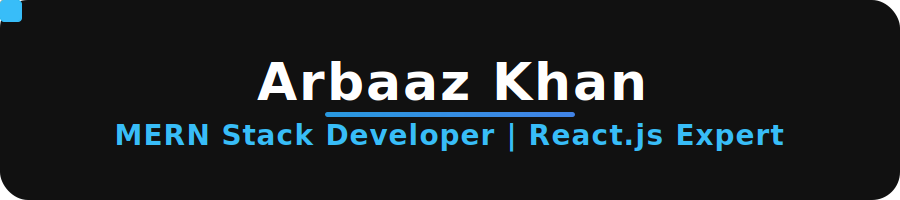

<!-- Profile Banner (animated GIF) -->

  

<h1 align="center">
  
</h1>

  <b>Frontend Developer | React.js Expert</b> 
  <i>Pixel-perfect design enthusiast, making every pixel count!</i>

  
  
  
  
  
  
  

---

  

---

### 🌈 About Me

- 🎨 Passionate about pixel-perfect design and CSS art.
- 🧑‍💻 Always experimenting on CodePen and exploring new frontend trends.
- 💬 Ask me about React, Redux, Typescript, or CSS wizardry!
- 🔗 [LinkedIn](https://www.linkedin.com/in/arbaazkhan1711)

---

<!-- Fun Animation with SVG -->

  

